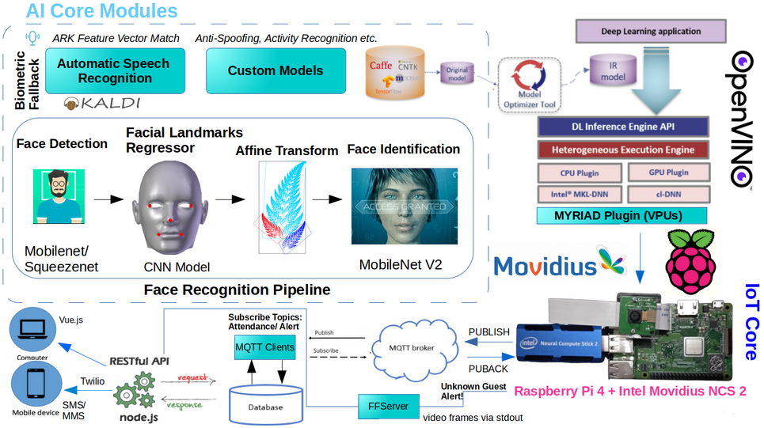
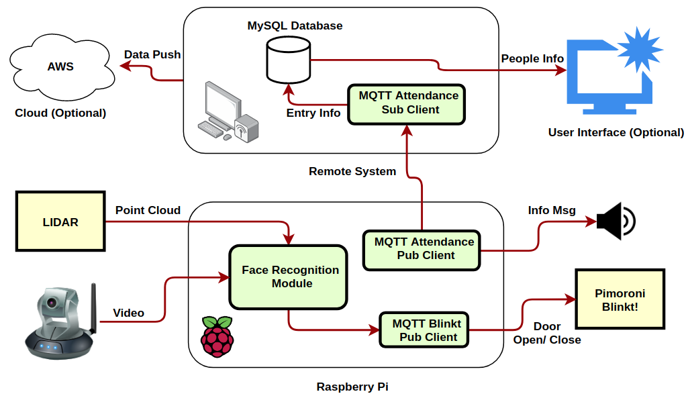

# Door Access Control & Attendance Registration
_Face Recognition based Attendance system deployable on Raspberry Pi, with Movidius NCS2 and RPLIDAR A1 for depth sensing to enable Door Access Control simulated with Pimoroni Blinkt!_

Touch-free interaction of all public devices has become an imperative post-Corona. No wonder, **facial recognition-based entry, and attendance gadgets are in much demand to replace attendance registers and bio-metric access control. These embedded devices can be used in big companies, flats, institutions, or even to take class attendance.**



Face recognition can be used to identify the person while depth information is required to open the door only to those near the door. Face Recognition based on Deep Learning gives better accuracy than Haar Cascade, LBPH, HOG, or SVM. Depth information can be gathered by LIDAR or DepthAI platforms like LUX-OAK-D that can combine depth perception, object detection, and tracking in one SoM. You can also use ultrasonic sensor HC-SR04 to detect person near door.

Four major steps involved in this project are,
- **Localize and identify face** (Raspberry Pi + Pi Cam + OpenVINO + Movidius)
- **Publish Identity** to the server (Use MQTT Pub-Sub for IoT communication)
- **Persist identity** and register attendance (MySQL or AWS)
- **Alert security** if the person is unidentified (SMS or MMS), else open the door.

We can choose to enhance the alert mechanism by pushing the **footage of unidentified persons notified to security via FFmpeg**.



During initial setup, the system should build an **image database of known persons**. During the registration process, an affine transformation is applied after detecting the facial landmarks of the person, to get the frontal view. Such images are saved in the Face Gallery which is later compared with, to identify the person.

The face recognition models done in OpenVINO are deployed to RPi, that is integrated with a Pi Cam and LIDAR. If the person is identified and is near to the door, then the 'door open' event is triggered.**If someone is near the door but not recognized then a message should be pushed to the security's mobile while keeping the door shut. This is simulated by flashing 'green' and 'red' lights respectively, on a Pimoroni Blinkt! controlled using  MQTT messages.**

An input frame is processed by the face detection model to predict face bounding boxes. Then, face keypoints are predicted by the corresponding model. Face recognition model uses keypoints found to align the faces and the face gallery to match faces found on a video frame with the ones in the gallery.

In order to avoid repeated triggers, the message gets published only when the same person is not found in the last 'n' frames (managed with a double-ended queue). If the person is identified, then the **greeting message is pushed via the eSpeak text-to-speech synthesizer**. Make sure the voice is properly set up in Pi.

Note that the **performance is optimal with 20 FPS (no face in frame) and 10-12 FPS (with faces) on a Raspberry Pi 4 with Intel Movidius NCS 2.**

We need to find out the **distance to the person from the door. This can be estimated by computing the median distance of LIDAR points between two subtending angles, based on the position of LIDAR w.r.t. Pi cam (triangulation)**

The **following pretrained OpenVINO models** can be used:

* `face-detection-retail-0004` and `face-detection-adas-0001`, to detect faces and predict their bounding boxes
* `landmarks-regression-retail-0009`, to predict face keypoints
* `face-reidentification-retail-0095`, to recognize persons

The project has been tested using OpenVINO 2019 (models included in repo) on a Raspberry Pi 4 and Pi Cam with RPLIDAR A1 M8 and Intel Movidius NCS 2.

## How to Use?

First, clone this repo to a Raspberry Pi. Set up Intel Movidius NCS 2 so that you can run OpenVINO models in it.

This is enough to run the Face Recognition module. Then connec the LIDAR via USB and install the required packages.
Further, you can connect a speaker to RPi after installation of eSpeak text-to-speech synthesizer.


``` sh
pip install -r requirements.txt

python3 ./face_recognition_demo.py -m_fd OV2019-models/face-detection-retail-0004.xml -m_lm OV2019-models/landmarks-regression-retail-0009.xml -m_reid OV2019-models/face-reidentification-retail-0095.xml -d_fd MYRIAD -d_lm MYRIAD -d_reid MYRIAD --verbose -fg "Face_Gallery/"

```

Press 'n' to increment the date so that next day attendance registration can be demonstrated.

On the MQTT reception side:
If you want to start afresh, you need to create the table in mysql for attendance data insertion.
If not, then the database file is already there in this repo (attendance.db). 

``` sql
create table attendance (id INTEGER PRIMARY KEY,name TEXT,date_in,time_in DATE,time_out TIME)
```

Copy the files inside `mqtt-client-code` folder to the remote machine. Execute `mqtt-attendance.py` to receive messages to register attendance.
The twilio account details need to be filled in correctly in `send-sms.py` file in order to get alert messages on mobile.

``` sh
python3 mqtt-attendance.py
nano send-sms.py
```
Note that the **performance is optimal with 20 FPS (no face in frame) and 10-12 FPS (with faces) on a Raspberry Pi 4 with Intel Movidius NCS 2.**

To simulate door open or close events, **connect a Pimoroni Blink! to the GPIO pins of RPi and execute `mqtt-blinkt.py`**. The light would flash 'green' and 'red' for open and close events respectively, based on the MQTT message. This is an optional step to demonstrate the access control function. In real deployment, it can be another control event communicated using MQTT.

**This project can be used in multiple scenarios driven by a person, event or custom objects.** To explicate, a customized video doorbell can be made to identify a person, event, or vehicle waiting at the door **to invoke an SMS, send video or audio message, or even to give an automated response.**

